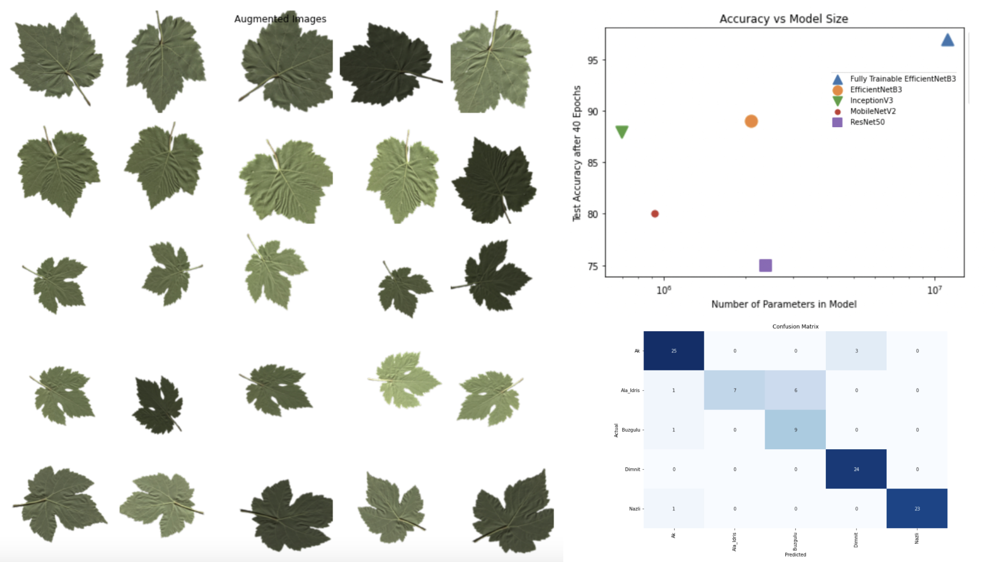

# 
 🌿🍇 Grapevine Leaves Classification 

## Table of Contents
 * [About the Project](#about-the-project)
	 * [Built With](#built-with)
 * [Getting Started](#getting-started)
	 * [Prerequisites](#prerequisites)
	 * [Usage](#usage)
* [Contact](#contact)

<!-- ABOUT THE PROJECT -->
## About The Project
This is a final project for the data mining course. Using pre-trained models and **transfer learning**, the aim is to classify the five classes of grapevine leaves. 
The pretrained models are **MobileNetV2**, **ResNet50**, **EfficientNetB3**, and **InceptionNetV3**.
We see the effects of **autoencoders** on the accuracy and use **10 fold cross validation** as a measurement. 

You can access the comprehensive report and the google colab notebook.

### Built With
* [Google Colaboratory](https://colab.research.google.com/)
* [Python 3](https://www.python.org/)
* [TensorFlow](https://www.tensorflow.org/)
* [Scikit Learn](https://scikit-learn.org/stable/)
* [Pandas](https://pandas.pydata.org/)
* [NumPy](https://numpy.org/)
* [Matplotlib](https://matplotlib.org/)
* [Seaborn](https://seaborn.pydata.org/)

<!-- GETTING STARTED -->
## Getting Started

### Prerequisites
 - Google Colaboratory

### Usage
In each folder click on the **ipynb file**. Then click on the **Open in Colab** badge. Please note that you need a google account to use colab.
You can easily navigate through the project using the *Table of contents*.

<!-- CONTACT -->
## Contact
If you have any further questions, please contact me via email.

Parisa Rabbany - Parisa.Rabbany.pr@gmail.com
